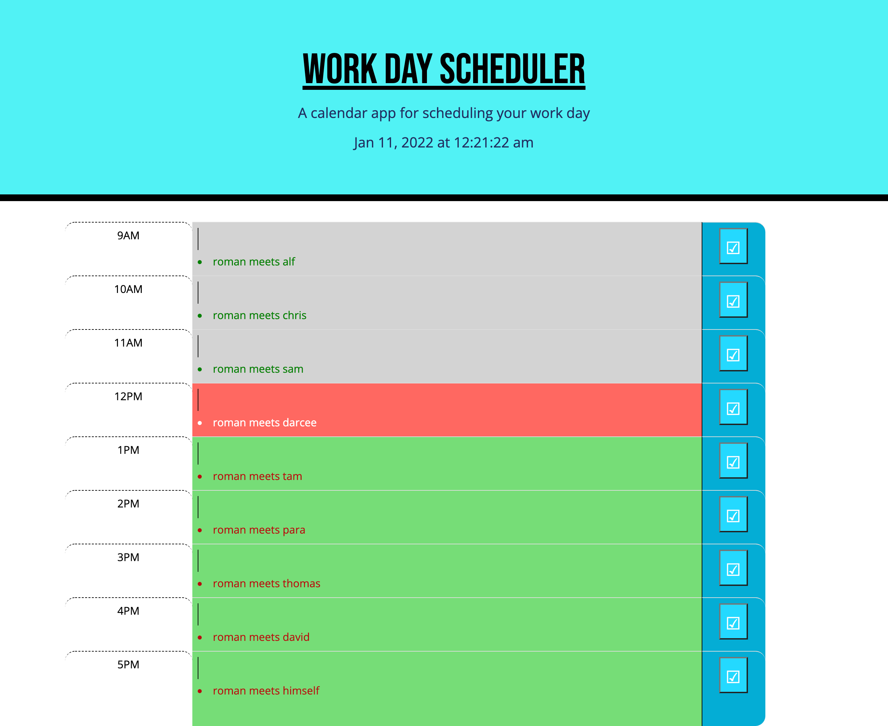

# <Work-Day-Scheduler-by-Roman_Ac>

# Mission
    * to build a work day scheduler to incorporate and list busy schedule of working day
    * to feature dynamically updated HTML & CSS
    * have a clean, polished and responsive user interface

# Parameters
    
    * upon opening the page current day and time is displayed on top
    * timeblocks of the the working day hours are displayed
    * each timeblock is color coded to indicate the status of past, present or future
    * on clicking the time block and event can be entered
    * on clicking the save button the event is stored in local storage
    * when page is refreshed the saved event persists

# Link to the page

https://roman-ac.github.io/work-day-scheduler-by-roman-ac/

# Screenshot

    
